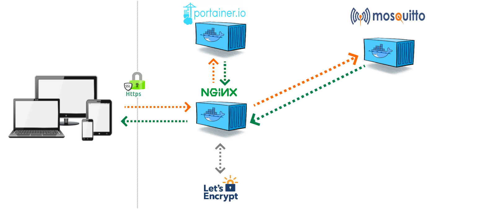

docker-mosquitto-Nginx-Let's Encrypt
=============

    

  mosquitto with Nginx and Let's Encrypt.

INSTRUCTION
---------------------

This version use the projet of EvertRamos : docker-compose-letsencrypt-nginx-proxy-companion

Please install first evertramos/docker-compose-letsencrypt-nginx-proxy-companion
https://github.com/evertramos/docker-compose-letsencrypt-nginx-proxy-companion

And after :
    git clone https://github.com/Tofdu31/docker-mosquitto-nginx-letsencrypt
    
Configure files projet Mosquitto
---------------------

1: Configure .env
---------------------
Open .env and change :

a) DOMAINS=mqtt.yourdomain.com

b) LETSENCRYPT_EMAIL=replace@thisemail.com

C) save .env

2 : Custom your mosquitto.conf
---------------------
Edit and configure your mosquitto/config/mosquitto.conf

3 : SERVER
---------------------
a) sudo touch mosquitto/config/mosquitto.conf mosquitto/data/pwfile

b) docker-compose up -d

c) docker-compose exec mosquitto sh

cd /etc/mosquitto

mosquitto_passwd -b pwfile username password

cat pwfile

username:$6$IuF7JUzS1k/QoF3y$YpiClom7/==

exit

d) docker-compose restart

e) docker-compose logs -f

